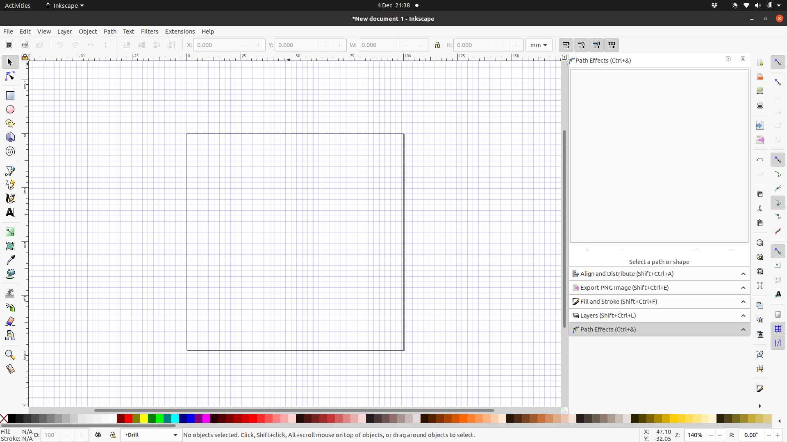
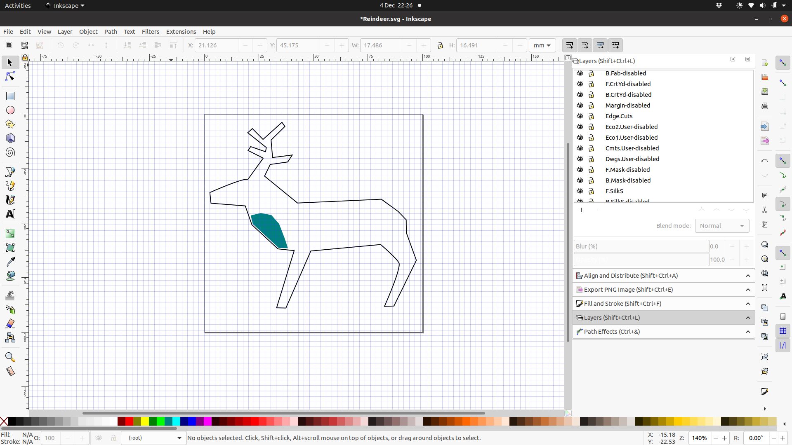
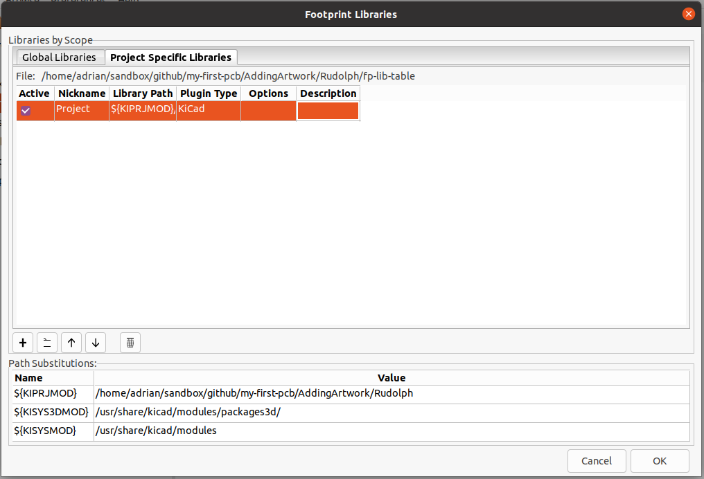

[FOSDEM talk about SVG2Shenzhen](https://www.youtube.com/watch?v=xXRPw7ItMaM)

[Twinkle Twinkie gave an excellent talk about his *awesome* PCB art](https://www.youtube.com/watch?v=Sbkvza8cKQE)

## Installing

 1. First off you'll need [Inkscape](https://inkscape.org/) installed.
 1. Then you should install the [SVG2Shenzhen](https://github.com/badgeek/svg2shenzhen) extension for Inkscape.  If you've got a version of Inkscape *before* 1.0 then you should install [SVG2Shenzhen release 0.2.17](https://github.com/badgeek/svg2shenzhen/releases/tag/0.2.17)

> On Linux, if you're getting an error with v0.2.17 with it not able to find the `.kicad_mod` file, make sure the `bitmap2component_linux64` file in the Inkscape extension folder has the executable permission set.

## Creating Kicad Modules of Your Artwork

As an example, we'll rework the PCB design from the [DesigningMyFirstBadgeLife](../DesigningMyFirstBadgeLife) tutorial.

 1. Run Inkscape

 1. Create a new document

 1. Prepare the document by choosing `Extensions` -> `Svg2Shenzhen` -> `1. Prepare document...` from the menu.  Set the document width and height to a little larger than the artwork you want to import into Kicad&mdash;for the example 100mm by 100mm.  Click `Apply` and then `Close`.

    

 1. Import your artwork into the document.  You can either do this by copying and pasting it from elsewhere or by choosing `File` -> `Import...` from the menu, finding the SVG to import&mdash;in this case `Rudolph.svg`&mdash;and then choose the "Include SVG image as editable object(s) in the current file" option.

 1. Next decide which layers you want to use.  `Shift-Ctrl-L` will bring up the list of layers.  Make sure that the layers you want *don't* have "-disabled" at the end of the name, and the layers you want to exclude *do* have "-disabled" at the end of their name.  Rename them accordingly.  I usually leave the `Edge.Cuts` and `Drill` layers enabled, even if I'm not using them.  For the example, we'll be using the `Edge.Cuts` and `F.SilkS` layers.

 1. Choose which layer you need for each bit of the artwork: select the element of the artwork; right-click; choose `Move to Layer...`; pick the relevant layer.  Favour darker colours over light ones, because SVG2Shenzhen creates the layers by placing each against a white background, so more contrast is better.  For the example, move the teal area to the `F.SilkS` layer and the black deer outline to the `Edge.Cuts` layer.  It should look like this:

    

 1. Save your design.  The filename you use will also be used for the finished Kicad module, for example, if you save your design as `my-logo.svg` you'll end up with a Kicad module called `my-logo.kicad_mod`.  For the example save it as `Reindeer.svg`.

 1. Create the Kicad module: 
    1. From the menu, choose `Extensions` -> `Svg2Shenzhen` -> `2. Export Kicad...`
    1. Enter the path to where to save your artwork Kicad module.  Picking the same location as your Kicad project is the easiest option.  FIXME Check this will show up properly
    1. Choose `Export layers as...` `KICAD - Module`
    1. You can leave the rest of the options as is.
    1. Click `Apply` to create the new `kicad_mod` file.  It might take a few moments to generate the module, once that's done you can close the dialog box and also Inkscape.

## Using Your New Kicad Module

 1. Run Kicad and open your design.  For the example you can open the project in [Rudolph](Rudolph/)

 1. We'll need to configure the footprint libraries paths so that it can find your new module.  Choose `Preferences` -> `Manage Footprint Libraries...` from the menu and switch to the `Project Specific Libraries` tab in the dialog.

 1. Click the `+` icon to add an empty row to the table.  Then fill in the `Nickname` as `Project` (because these are modules local to the project) and the `Library Path` as `${KIPRJMOD}/`:

    

 1. Click `OK` to close the `Footprint Libraries` dialog and then open PcbNew (From the toolbar menu, `Tools/Edit PCB` or the `PCB Layout Editor` icon).

 1. Choose the `Add footprints` tool and click somewhere to add a footprint.

 1. Find the `Project` library and choose the `Reindeer` footprint.

 1. Place it into the board in a suitable location.

# Next Steps 🧩

Here are the other lessons, if you haven't already taken a look:

 * [Making Footprints](MakingFootprints) or "I want to use a part that isn't in the library!"
 * [Now Available In 3D](NowAvailableIn3D).  Making 3D models of your board (and creating 3D models for parts without them)

We've also written some notes on other things to consider, such as how to share your design, thoughts on supply chains and other considerations, in [ResponsibleElectronics](ResponsibleElectronics).

If you have any requests for more guides, email [info@mcqn.com](mailto:info@mcqn.com) with your suggestions.

And if you got something useful from this guide and would like to support us in our work on open source hardware, software, and guides like this one, consider [contributing via ko-fi]()https://ko-fi.com/s/d90aba90e1).
