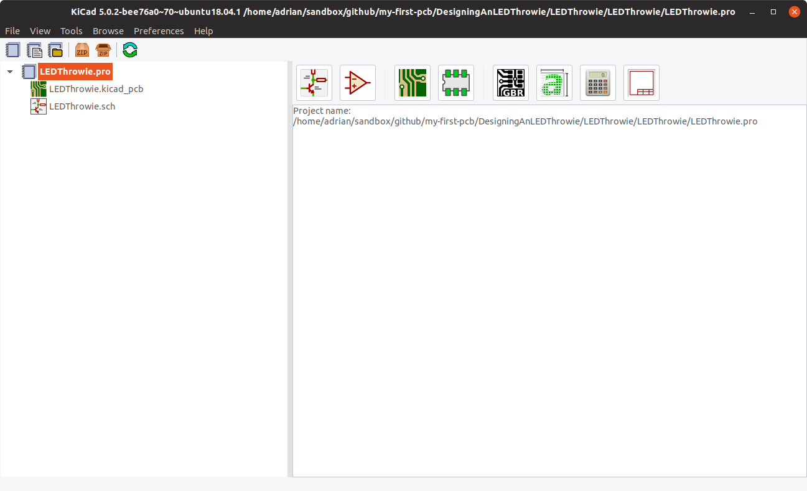

# The Basics - Designing an LED Throwie

We're going to start with one of the simplest circuits for our first badge: a battery-powered LED.

1. ## Installing Kicad

   Download the latest stable version of Kicad for your operating system from the [Kicad downloads page](http://kicad-pcb.org/download/).  You should make sure it is at least v5.1.5 (that's what all the example files are saved as, if you want to compare them)

1. ## Build the schematic

   Open Kicad

   Choose `File` -> `New` -> `Project...` and give it a name

   

   Double-click on the schematic file `.sch`.  The first time you run Kicad it might ask you to "Configure Global Symbol Library Table".  Choose the recommended option.

   

   You should now see the main blank Eeschema work area.  This is where you lay out the schematic of your circuit&mdash;the "tube map" version if you will.  It focuses on what connects to what, not on *where* each part will actually be.

   

   Select `Place power port` in the Tools on the Right for from `Place/Power Port` drop down menu.  For a simple circuit like an LED throwie this is a bit of an overkill, but it's a good habit to get into for more complex circuits.

   The power ports aren't things that will show up physically in your PCB, but ways to link common connections together without having to draw wires between them all, given how common it is to want to link something to GND, for example.  (You can do a similar thing with Labels too, if you want to define your own)

   

   Choose the `GND` Power flag, GND from the symbol list and then place it somewhere in the lower half of your schematic.  Don't worry too much about exactly where, you can always move it later if you need to.

   

   Then repeat the process to place a `+BATT` power port, somewhere in the upper half of your schematic.  You'll end up with something like this:

   

   Now we'll place the symbols that *will* translate into physical components on the finished PCB.

   Select `Place symbol` in the Tools on the Right or from `Place/Symbol` drop down menu and type `BATT` in the search window at the top.  Then choose the `Battery_Cell` symbol and place it in the work area

   

   Similarly, add the `LED` symbol to the work area

   

   Your work area should now look like this

   

   Now add the `R_Small` symbol to the work area

   

   Your work area should now look like this

   

   Next we need to wire up the circuit.

   Select the green `Place wire` in the Tools on the Right or from `Place/Wire` drop down menu

   

   Draw a line with the `Place wire` tool from the round end point footprint at the top of the passive resistor `R_Small` symbol to the `+BATT` symbol

   

   Draw a line with the `Place wire` tool from the round end point footprint of bottom of the passive resistor `R_Small` symbol to the top of the `LED` symbol

   

   Draw a wire from the round end point footprint of bottom of the `LED` symbol to the `GND` symbol

   

   Draw a wire from the round end point footprint of the `-` of the `Battery_Cell` symbol to the green wire connected to the `GND` symbol. This will generate a small green dot to show that this is a junction, and means the wires are connected at that point.  Wires that cross over *without* the green dot aren't connected together, but it's best to avoid that wherever possible.

   

   Draw a wire from the round end point footprint of the `+` of the `Battery_Cell` symbol to the green wire connected to the `+BATT` symbol. This will generate a junction.

   Now all of our schematic is wired up.

   

   We should set the properties of the components so that anyone reading it will know what sort of components to use.

   Double click on the `Battery_Cell` to edit the value field or right click and select `Properties/Edit Properties`

   

   Change the `Field Value` of the `Battery_Cell` to `CR2032`  

   

   Repeat the process for the resistor, and replace the `R_Small` value with the desired resistance value, in this case `560` ohms.

   The final step in creating the schematic is to annotate the components.  This will number them so that if, for example, you had a couple of LEDs on your schematic, you could differentiate between them.

   

   Click the `Annotate` button in the toolbar to bring up the annotations dialog box.  The default options will be fine, so go ahead and click the `Annotate` button.  And, assuming there are no errors in the messages box, then click `Close`.

   

   Your work area should look like this.  Note that the components now end with numbers rather than question marks.

   

1. ## Footprints and netlist

   Now the schematic is finished it's time to turn our attention to the physical layout of the PCB.

   First off we need to specify the physical shape of the components we're using: their *footprints*.  the footprints for components fall into two main classifications: *through hole* and *surface mount* (sometimes also referred to as *SMT* or *SMD*).

   Through hole components are probably what you're more familiar with.  They have legs that go *through* a *hole* in the PCB and you tend to solder them on the opposite of the PCB from the side the components sits on.

   Surface mount components are soldered to the same *surface* of the PCB that the component sits.  They are much more popular with mass-manufactured PCBs because the components are much easier to place automatically with a pick-and-place machine.  They can also be smaller because they don't need a hole big enough for a wire to pass through for each leg.  That's a good thing when you're designing a mobile phone and want it to be as small as possible, but can be a bit challenging if you're going to solder them by hand.

   However, more components are only available as surface mount, and if you're designing the PCB you can often avoid the hardest-to-hand-solder footprints, so for this example we'll run with surface mount.

   (If you *really* want to avoid surface mount then feel free to find through-hole alternatives&mdash;generally hunt through the `_THT` footprint libraries rather than the `_SMD` options&mdash;to the footprints on this board and use that for the remaining steps.  It will work just the same)

   We'll use these three components for our board:

   * CR2032 holder - [CPC BT06539](https://cpc.farnell.com/pro-power/pp002088/battery-holder-coin-cell-cr2032/dp/BT06539), which maps to Keystone 1060 in the standard Kicad `Battery` footprint library; 
   * An 0805 LED - there are many options to buy for these, so you can pick whatever colour takes your fancy.  The "0805" bit refers to the physical size of the LED: it's 8 hundredths-of-an-inch by 5 hundredths-of-an-inch (or 2x1.27mm in metric).  Picking the `HandSolder` option in the Kicad `LED_SMD` library will, unsurprisingly, make it easier to solder by hand.
   * An 0603 resistor.  Again the "0603" refers to the size, in hundredths-of-an-inch, so this is a bit smaller than the LED: 1.6x0.8mm.  I've found that these are fine, if a touch fiddly, to solder by hand&mdash;again, choose the `HandSolder` option in the Kicad `Resistor_SMD` library.

   Personally I don't pick anything smaller than 0603 if I'm doing the soldering.  There are 0402 and 0201 options, but you need a microscope and a *very* fine soldering iron for those.  If you're unsure of your soldering abilities, feel free to swap the LED and resistor options for 1206 or even 1812 versions.

   In the schematic, choose `Tools` -> `Assign Footprints...` from the menu.  That will open the `Assign Footprints` dialog.

   

   The first time you do this you will load up your footprints library. You may have to configure libraries for parts not included in your Kicad setup. 

   Choosing one of the libraries in the left-most column will bring up the list of available footprints in the right-most column.  (No, I don't know why they're either side of the list of components from the schematic either...)  Then pick the relevant component in the middle column and double-click the footprint you want in the right-most column to assign it.  Edit each entry in the list of components in the centre to match the footprints detailed in the list above.

   Once you've assigned them all, click `OK` to close the `Assign Footprints` dialog.

   The final task in the schematic editor is to generate the netlist.  From the menu, choose `Tools` -> `Generate Netlist File...`

   

   Click `Generate Netlist` and save it with the suggested name.

1. ## Lay out the PCB

   

   

   

   

   

   

   

1. ## Getting physical boards

   1. Generating Gerbers and drill file
   1. Making them...
      * Milling your own PCB
      * Sending them to a PCB fab house

