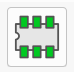
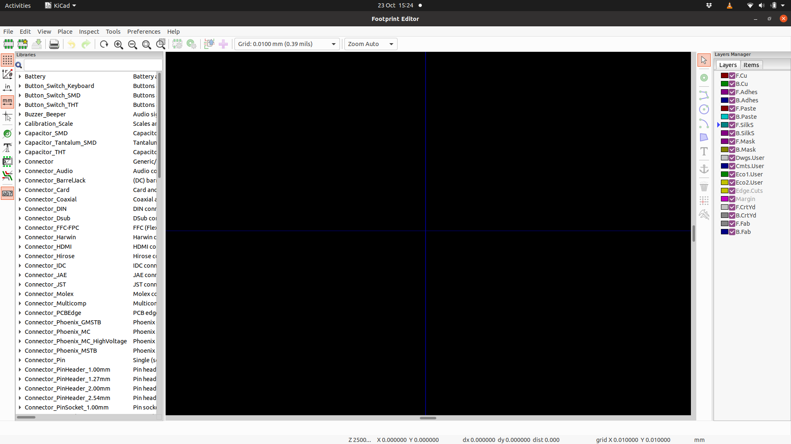
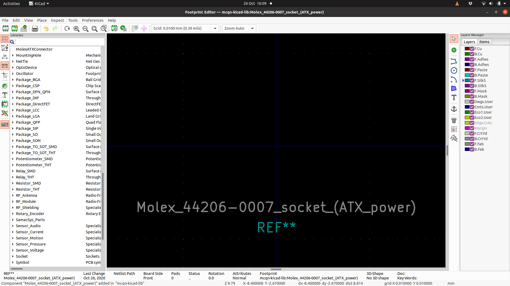
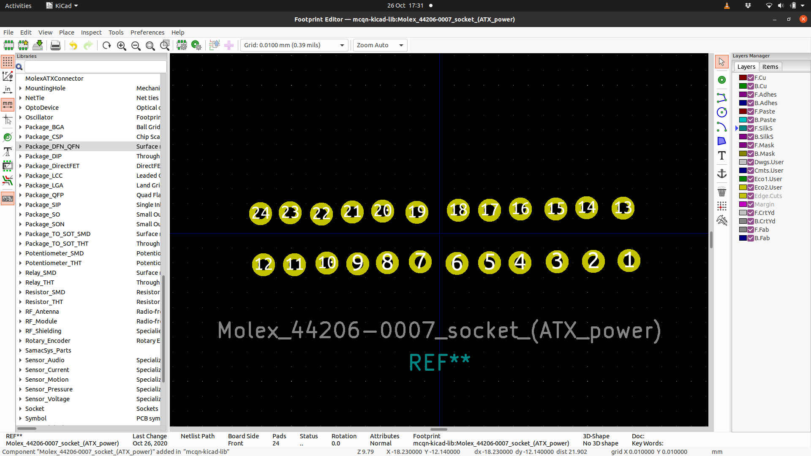
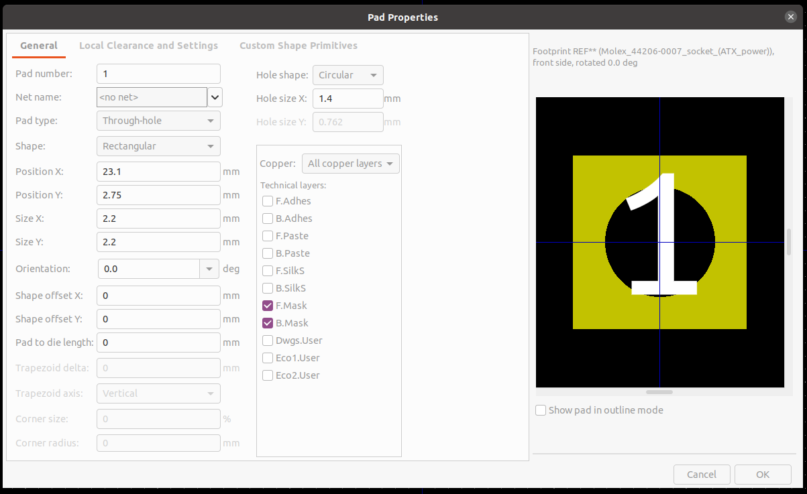
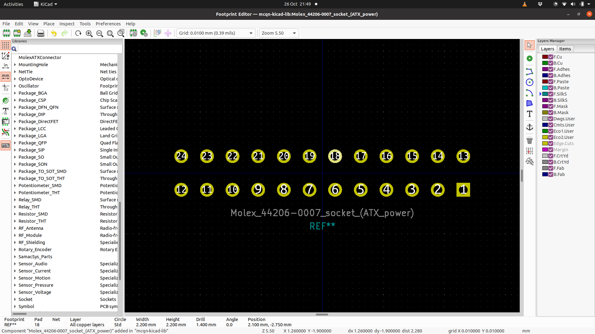
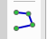
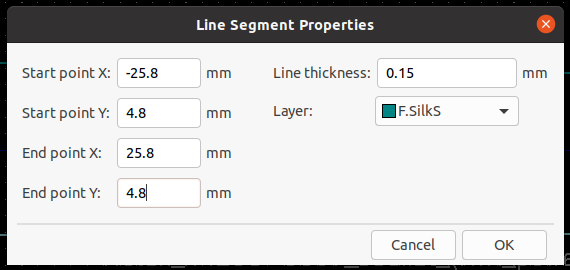
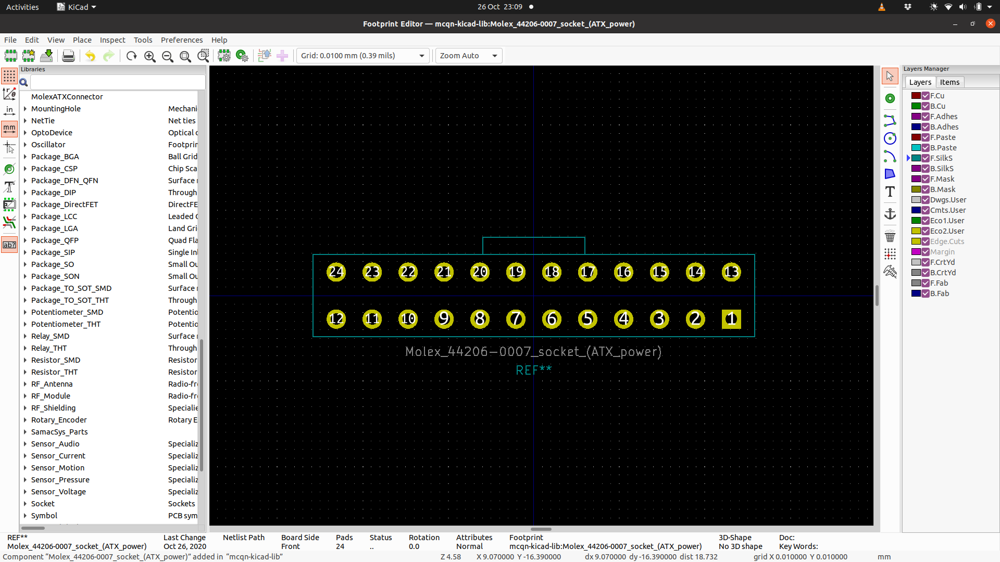

# Making Symbols and Footprints

(Or what to do when a component isn't in Kicad's libraries)

Sooner or later when you're designing electronics you'll end up using something that isn't already in the Kicad libraries.

There are a few approaches you can take to solve this problem:

  1. Find a library someone else has made containing the part you're after.  One of the joys of the open source community is that people share things that they've made.  Searching for "kicad and name-of-the-missing-component" might come up trumps.  Then you just need to check that the pin assigments and footprint match what you're expecting, and add the library to your project.
  1. Use a substitute component.  Sometimes, although the *exact* component you're using isn't in the Kicad library, there will be one that's close enough that you can substitute it without causing any issues in the PCB design.  We could take that approach with the ATX power connector we'll work through in the rest of this tutorial: a generic 2x12 connector would work as a symbol for the schematic, and a `Molex_Mini-Fit_Jr_5566-24A_2x12_P4.20mm_Vertical` footprint might have worked, if we could find a connector without the mounting pegs.
  1. Create the component yourself.  If neither of the other options works, you can create your own components to add to your library.  This is the option we'll take for this tutorial, with a worked example to create both a symbol and a footprint for a connector for a PC ATX power supply.  (This was something I needed when designing the PCB for [the My Baby's Got LED board](https://mcqn.com/ibal223/))

You might not need to follow *both* halves of this tutorial, depending on what's missing.  Many components are available in standard packages&mdash;DIP-16, SOT-223, etc.  In that case, you'd just need to create the symbol, and use the off-the-shelf footprint.  And sometimes you'll have a component that *is* in the symbol library, but you're using an usual package for it and you'll need to create a custom footprint.

## Preparation

Before you start creating the components, you should gather the information you'll need.  Usually that's all in the datasheet for the component you're using, but sometimes the footprints will be in a separate technical drawing file.

Occassionally, like in our example here, there isn't a standard datasheet and you'll need to pull the information together from a couple of sources.  For our ATX power connector, we're going to use [this explanation of the ATX power supply pinout](https://www.smpspowersupply.com/connectors-pinouts.html) and then the [technical drawing for the Molex 44206-0007 socket](https://www.molex.com/pdm_docs/sd/442060007_sd.pdf).

## Symbols

  1. From either the main Kicad screen, or from within the EESchema schematic editor, launch the Symbol Editor by clicking on the icon or choosing it from the `Tools` menu.
     
     That will open the `Symbol Editor` and show you a blank workspace like this:
     
  1. It makes sense not to add your components to the core libraries, in case they're updated when you upgrade Kicad.  I tend to create one library to hold all of the assorted components that I create, but you can either do that or group them thematically.

     If you need to create a new library:

     1. Choose `File` -> `New Library...` from the menu.
     1. Pick a file name for your library.  If you're planning on having a single common library for all of your Kicad projects then find a suitable central location (I have mine in a separate Gitlab repository), otherwise just save it in your project folder
     1. If you chose a common library in the last step, select `Global` in the `Add to Library Table` dialog box; otherwise choose `Project` and click `OK`
        
  1. Choose `File` -> `New Symbol...` from the menu.
  1. Choose the library that you just created (or your common library if you already had it) from the list in the `Select Symbol Library` dialog, and click `OK`
  1. Fill in the symbol properties.  Most can be left at the default setting, but give it a name that will make it easy to remember what it's doing, and/or easy to search for, when you're looking to add it later.  If it's a chip or some other esoteric component then leaving the default reference designator as `U`, but if there's a commonly used alternative&mdash;`R` for resistors, `D` for diodes, etc.&mdash;then change change it accordingly.  Connectors, or *ports*, are usually referred to with `P`, so we'll use that here.
     
  1. The workspace will then look like this, with the name and designator on top of each other at the centre of the component (position (0,0))
     
     Make some room for laying out the symbol by moving the name and designator down, and separating them out with the designator above the name.  If you hover over the thing you want to move and type `m`, then you can move it around.  Something like this:
     
  1. Now we can start adding the pins.  These are any of the electrical connections that your component has.

     As we're generating a *symbolic* representation of the component, it makes more sense to group the connection pins thematically rather than mimicking their physical layout.  (However, this is purely a matter of personal preference, so if you'd rather lay them out in the same order as they appear in real life, feel free)

     The ATX power supply connector has eight types of connection: +3.3V, -12V, GND, +5V, PS_ON# (pulled to GND to turn the supply on), PWR_OK, +5VSB (standby power, still live when the rest of the supply is off), and +12V.  Plus one pin in the connector isn't connected to anything.

     

     Click on the `Pin Table` icon in the toolbar, which will open the `Pin Table` dialog

     

  1. Click `+` to add a pin.  Enter its number, the logical name, and choose the type.  For example, pin 1 on the ATX connector has the name `+3V3` and the type is `Power input`.  Don't worry too much about the `Graphic Style` or `Orientation` fields for now, and as a starting point (so that the pins don't end up all on top of each other) set the `Y Position` to the same value as the `Number`.

     Work through the same steps, adding the rest of the pins for the component, as detailed in [the connector diagram](https://www.smpspowersupply.com/connectors-pinouts.html).  Most of the pins for the ATX connector will be of type `Power input`, apart from `PWR_OK` (which is an `Input`), `PS_ON#` (an `Output`), and `N/C` (`Not connected`).

     Once all the pins are entered, it should look like this.  Then click `OK` to close the `Pin Table` dialog window.

     

  1. Now you'll have this slightly messy view:

     

     It's uncommon to have so many pins with the same name, but in this instance move all of the pins with the same name to be on top of each other.  If you hover over a pin, you can then press `m` to move it around.  If you want to move a group of pins at once you can drag a box over all of them instead.

     Once you've got them grouped, find a sensible arrangement for them.  It's common for the `GND` connection to be at the bottom, so we'll do that here.  Then we'll have the main voltage pins on the left, and the rest on the right.  Something like this:

     

  1. All of the pins currently have their "connector" (where a wire will join the pin in the schematic) on the left, and their name on the right.  For the right-hand column of pins we should reverse that, and likewise update the `GND` pins to have the name at the top.

     Reopen the `Pin Table` dialog.  In the `Orientation` field, update the values for the `PWR_OK`, `+5VSB`, `PS_ON#` and `N/C` pins to `Left`, and all of the `GND` pins to `Up`.

     

     Click `OK` to close the `Pin Table` dialog.  You might need to move some of the pins around to tidy up their positioning.

     

  1. Finally, choose the `Rectangle` tool from the right-hand toolbar, or choose `Place` -> `Rectangle` from the menu...

     

     And draw a rectangle around the pin names, along the ends of the pins themselves.  Obviously for more complex symbols you can use the cirle, arc, and polygon tools to draw it out.

     Once the rectangle is drawn, if you double-click on one of the sides, it will bring up the `Rectangle Drawing Properties` dialog.

     

     Choose the "Fill with body background color" and the click `OK` to colour in the area of the component.

     For a last bit of fit-and-finish, because we have multiple pins in the same position on the ATX connector symbol, we should hide all but one of each group of pins.

     Hovering over a group of pins and type `e`.  That will pop up a menu showing a list of the relevant pins.  Choosing one will bring up the `Pin Properties` for that pin:

     

     If you uncheck the `Visible` checkbox then that pin will show up in the Symbol Editor as grey, and won't show at all in the schematic.  Repeat the process for each pin *except* the bottom one on the list, and repeat that process for each of the groups of pins.

     

     With that done, our symbol is finished and ready to use in your schematic.  Choose `File` -> `Save` from the menu, and close the Symbol Editor.

## Footprints

  1. From the main Kicad screen launch the Footprint Editor by clicking on the icon or choosing it from the `Tools` -> `Edit PCB Footprints` menu.

     

     That will open the `Footprint Editor` and show you a blank workspace like this:

     

  1. As with any symbols you add, it makes sense not to add your footprints to the core libraries, in case they're updated when you upgrade Kicad.  I tend to create one library to hold all of the assorted components that I create, but you can either do that or group them thematically.

     If you need to create a new library:

     1. Choose `File` -> `New Library...` from the menu.
     1. Pick a file name for your library.  If you're planning on having a single common library for all of your Kicad projects then find a suitable central location (I have mine in a separate Gitlab repository), otherwise just save it in your project folder
     1. If you chose a common library in the last step, select `Global` in the `Select Library Table` dialog box; otherwise choose `Project` and click `OK`

  1. Next, choose `File` -> `New Footprint...` which will ask you for a name.  Give it a suitably descriptive name so you can easily recognise what it is in future.  The part number is a good choice.  For this connector we'll go with `Molex_44206-0007_socket_(ATX_power)`&mdash;Manufacturer, then Part Number (and an extra description) and click `OK`

  1. Move the `REF**` and name labels down a bit, to clear some room for drawing out the footprint.  Select each item in turn, then type `m` and drag it to a new location.  After you're done, it should look something like this:

     

  1. As it translates into the physical footprint on the PCB, it's important for your dimensions to be correct.  Having [the technical drawing or datasheet](https://www.molex.com/pdm_docs/sd/442060007_sd.pdf) to hand will help here.  The other important step is to get the orientation of the pins right.  The pin numbers you configured in the symbol *must* correspond to the correct pin in the footprint.

     Often the drawing will have the pins labelled, but the one we have for the Molex connector doesn't.  We can use the [pinout diagram](https://www.smpspowersupply.com/connectors-pinouts.html) we used for the schematic, but remember that the diagram there is for the *plug* and so we'll need to mirror that for the *socket*.  It can be helpful to have the physical part to hand too, to check against your design or the datasheet.

     We need to place the pins onto the footprint.  To do that select the `Add pad` tool from the toolbar, of via the `Place` -> `Pad` menu:

     

     Place all of the pads in their general location&mdash;we'll tidy them up in a moment.  Once all 24 are placed, it will look like this (and you can leave the `Add pad` tool by pressing `Esc` or selecting the pointer from the toolbar):

     

  1. Now we can edit each pad to set its location correctly and any other parameters we need.  Click on pad 1, and press `e` to edit it.  That will bring up its properties dialog:

     

     There's quite a bit to go through here, so we'll take each of the important fields in turn:

      * **Pad number** This is the number that will get matched to the pin in the symbol.  They should be in the right order, but you can edit things here if they're not
      * **Pad type** What sort of pad is this?  All of our pins for the Molex connector are `Through-hole` (where a hole is drilled into the PCB that the pin pushes through), but `SMD` is common for surface-mount components.  We'll also use `NPTH, Mechanical` option later, when we're adding the mounting pegs
      * **Shape** The shape of the copper part of the pad.  We can leave the rest of them as `Circular`, but it's useful to make pin 1 `Rectangular` so that we can spot it on the finished PCB.
      * **Position X** The X coordinate of the centre of the pad.  Looking at the technical drawing we can see from the table in the bottom left that dimension `A` for a 24-pin connector will be 46.2mm (or 1.82").  As we're centring the connector, we'll want half to the right and half to the left, so pin 1 will be at 23.1mm.  From the "recommended hole layout" section of the drawing we can see that the pins are spaced 4.20mm apart, so pin 2 will be at 18.9mm; pin 3 at 14.7mm, pin 4 at 10.5mm, pin 5 at 6.3mm and pin 6 at 2.1mm.  Pins 7 to 12 will have the negative equivalents of 6 to 1, so from -2.1mm to -23.1mm.
      * **Position Y** The Y coordinate of the centre of the pad.  The "recommended hole layout" section again shows us that the two rows are spaced 5.50mm apart, and as we're centring the connector the top row (pins 13 to 24) will be at half of that: -2.75mm, and the bottom row (pins 1 to 12) will be at 2.75mm
      * **Size X** The width of the copper part of the pad.  Because the hole size is larger than normal, we should make this bigger too so that there's a decent amount of copper to solder to.  2.2mm will be sufficient.
      * **Size Y** The height of the copper part of the pad.  For `Circular` pads this will be greyed-out as the `Size X` value defined the diameter of the circle.  We should make this 2.2mm too.
      * **Hole size X** The diameter of the hole drilled into the PCB.  From the technical drawing we can see that it should be 1.40mm.

     Repeat the process for the remaining pads to end up with this:

     

  1. Now we'll add the outline of the connector to the silkscreen.  The top left diagram in the technical drawing is best for that, and we'll draw a fairly simple rectangle of dimension `B` (for the 24-pin connector the table in the bottom-left corner tells us that's 51.6mm) by 9.6mm.

     Choose the `Add graphic line` tool from the toolbar, or via the `Place` -> `Line` menu:

     

     Draw a rectangle around the pads, ending it with a double-click.  Then choose the mouse pointer tool again (or press `Esc`).

     Select each of the sides of the rectangle in turn, and type `e` to edit it.  Set the start and end coordinates of the side accordingly - the top-left corner is at [-25.8,-4.8] and the bottom-right corner at [25.8,4.8].

     

     The line thickness of 0.15mm will be fine.  And we want it to be drawn on the silkscreen on the front of the PCB (it will move to the back silkscreen if you move the footprint to the back of the board), but if you wanted to draw lines onto a different layer of the PCB you could change that here.

  1. We should also draw the clip from the side of the connector, to remind us which way round the connector fits and more importantly remind us that there's a clip on that side, so we shouldn't place components *too* close to it in case it makes it hard to remove the plug after the PCB is assembled.

     Using the `Add graphic line` tool again, draw the three sides of the clip onto the top edge of the connector outline.  The technical drawing shows that it's 11.90mm wide, but fails to give a dimension for how wide it is.  We'll eyeball it at 2mm, as it's not a critical dimension for fitting the component to the board.  Edit the lines so that they're from [-5.95, -6.8] to [5.95, -4.8].

     Giving you this:

     

  1. The last step is to add the holes for the mounting pegs on the connector.  Using the `Add pad` tool, add two new pads one either side of the connector roughly in line with the top row.  Select each in turn and edit it.

     Set the `Pad type` to `NPTH, Mechanical` to show that it's just a mounting hole.  Consulting the "recommended hole layout" on the technical drawing again, we can see that the holes are 3mm in diamter.  The centre of the hole is 4.70mm in the X dimension from the end pin, so at (-)27.8, and 0.46mm below the top row on the Y dimension, so at -2.29mm.  The pad size also needs to be increased, so that it's the same size as the hole.

     

  1. With the footprint now finished, all that remains is to save it.  Choose `File` -> `Save` from the menu; then choose the library that you created at the start (or the one you've already created to store your footprints) and click `Save`

