# Making Symbols and Footprints

(Or what to do when a component isn't in Kicad's libraries)

Sooner or later when you're designing electronics you'll end up using something that isn't already in the Kicad libraries.

There are a few approaches you can take to solve this problem:

  1. Find a library someone else has made containing the part you're after.  One of the joys of the open source community is that people share things that they've made.  Searching for "kicad and name-of-the-missing-component" might come up trumps.  Then you just need to check that the pin assigments and footprint match what you're expecting, and add the library to your project.
  1. Use a substitute component.  Sometimes, although the *exact* component you're using isn't in the Kicad library, there will be one that's close enough that you can substitute it without causing any issues in the PCB design.  We could take that approach with the ATX power connector we'll work through in the rest of this tutorial: a generic 2x12 connector would work as a symbol for the schematic, and a `Molex_Mini-Fit_Jr_5566-24A_2x12_P4.20mm_Vertical` footprint might have worked, if we could find a connector without the mounting pegs.
  1. Create the component yourself.  If neither of the other options works, you can create your own components to add to your library.  This is the option we'll take for this tutorial, with a worked example to create both a symbol and a footprint for a connector for a PC ATX power supply.  (This was something I needed when designing the PCB for [the My Baby's Got LED board](https://mcqn.com/ibal223/))

You might not need to follow *both* halves of this tutorial, depending on what's missing.  Many components are available in standard packages&mdash;DIP-16, SOT-223, etc.  In that case, you'd just need to create the symbol, and use the off-the-shelf footprint.  And sometimes you'll have a component that *is* in the symbol library, but you're using an usual package for it and you'll need to create a custom footprint.

## Preparation

Before you start creating the components, you should gather the information you'll need.  Usually that's all in the datasheet for the component you're using, but sometimes the footprints will be in a separate technical drawing file.

Occassionally, like in our example here, there isn't a standard datasheet and you'll need to pull the information together from a couple of sources.  For our ATX power connector, we're going to use [this explanation of the ATX power supply pinout](https://www.smpspowersupply.com/connectors-pinouts.html) and then the [technical drawing for the Molex 44206-0007 socket](https://www.molex.com/pdm_docs/sd/442060007_sd.pdf).

## Symbols

  1. From either the main Kicad screen, or from within the EESchema schematic editor, launch the Symbol Editor by clicking on the icon or choosing it from the `Tools` menu.
     
     That will open the `Symbol Editor` and show you a blank workspace like this:
     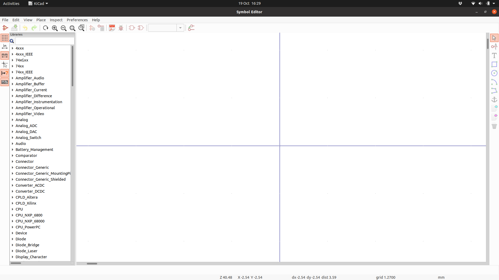
  1. It makes sense not to add your components to the core libraries, in case they're updated when you upgrade Kicad.  I tend to create one library to hold all of the assorted components that I create, but you can either do that or group them thematically.

     If you need to create a new library:

     1. Choose `File` -> `New Library...` from the menu.
     1. Pick a file name for your library.  If you're planning on having a single common library for all of your Kicad projects then find a suitable central location (I have mine in a separate Gitlab repository), otherwise just save it in your project folder
     1. If you chose a common library in the last step, select `Global` in the `Add to Library Table` dialog box; otherwise choose `Project` and click `OK`
        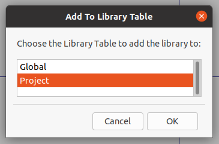
  1. Choose `File` -> `New Symbol...` from the menu.
  1. Choose the library that you just created (or your common library if you already had it) from the list in the `Select Symbol Library` dialog, and click `OK`
  1. Fill in the symbol properties.  Most can be left at the default setting, but give it a name that will make it easy to remember what it's doing, and/or easy to search for, when you're looking to add it later.  If it's a chip or some other esoteric component then leaving the default reference designator as `U`, but if there's a commonly used alternative&mdash;`R` for resistors, `D` for diodes, etc.&mdash;then change change it accordingly.  Connectors, or *ports*, are usually referred to with `P`, so we'll use that here.
     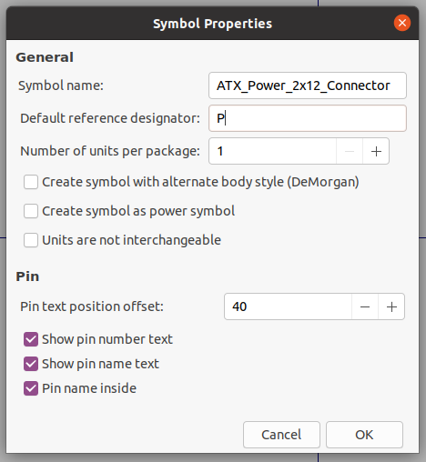
  1. The workspace will then look like this, with the name and designator on top of each other at the centre of the component (position (0,0))
     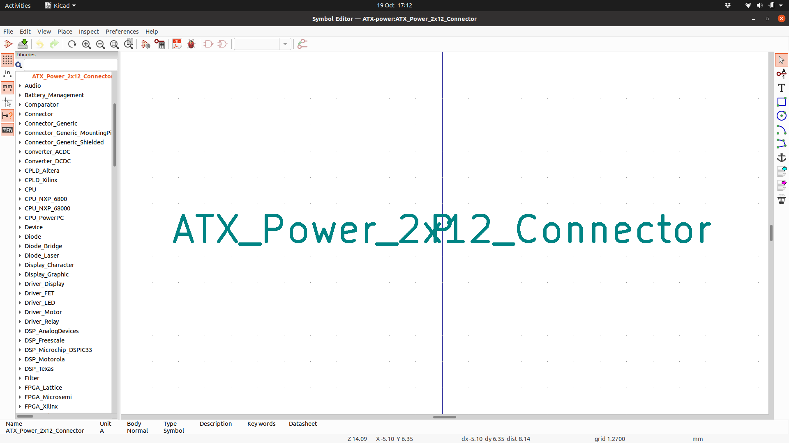
     Make some room for laying out the symbol by moving the name and designator down, and separating them out with the designator above the name.  If you hover over the thing you want to move and type `m`, then you can move it around.  Something like this:
     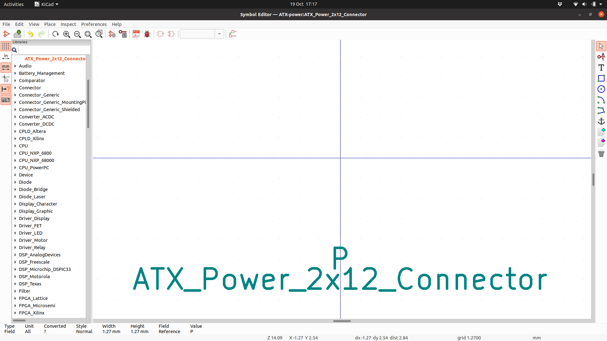
  1. Now we can start adding the pins.  These are any of the electrical connections that your component has.

     As we're generating a *symbolic* representation of the component, it makes more sense to group the connection pins thematically rather than mimicking their physical layout.  (However, this is purely a matter of personal preference, so if you'd rather lay them out in the same order as they appear in real life, feel free)

     The ATX power supply connector has eight types of connection: +3.3V, -12V, GND, +5V, PS_ON# (pulled to GND to turn the supply on), PWR_OK, +5VSB (standby power, still live when the rest of the supply is off), and +12V.  Plus one pin in the connector isn't connected to anything.

     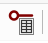

     Click on the `Pin Table` icon in the toolbar, which will open the `Pin Table` dialog

     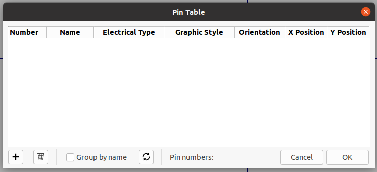

  1. Click `+` to add a pin.  Enter its number, the logical name, and choose the type.  For example, pin 1 on the ATX connector has the name `+3V3` and the type is `Power input`.  Don't worry too much about the `Graphic Style` or `Orientation` fields for now, and as a starting point (so that the pins don't end up all on top of each other) set the `Y Position` to the same value as the `Number`.

     Work through the same steps, adding the rest of the pins for the component, as detailed in [the connector diagram](https://www.smpspowersupply.com/connectors-pinouts.html).  Most of the pins for the ATX connector will be of type `Power input`, apart from `PWR_OK` (which is an `Input`), `PS_ON#` (an `Output`), and `N/C` (`Not connected`).

     Once all the pins are entered, it should look like this.  Then click `OK` to close the `Pin Table` dialog window.

     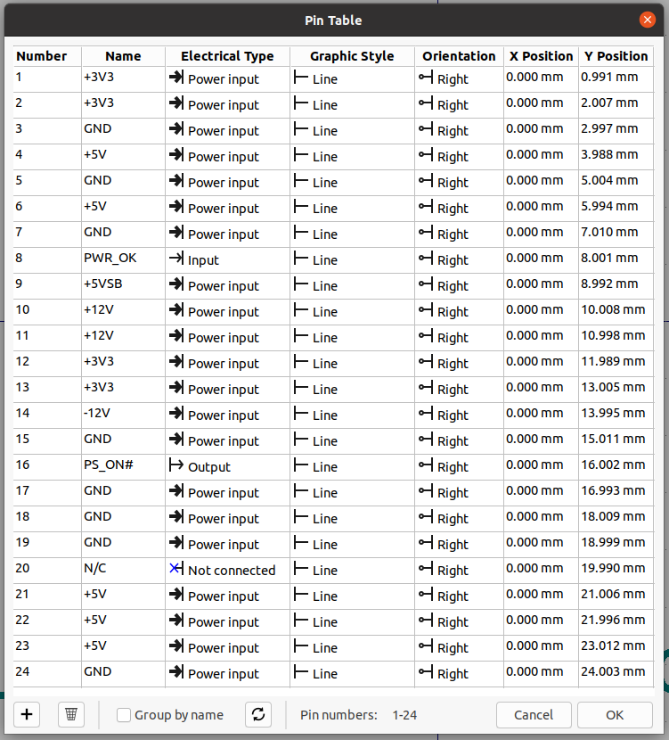

  1. Now you'll have this slightly messy view:

     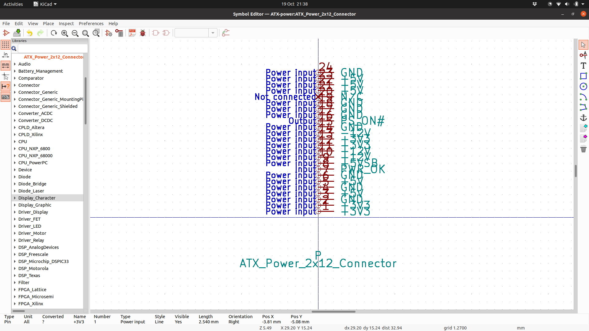

     It's uncommon to have so many pins with the same name, but in this instance move all of the pins with the same name to be on top of each other.  If you hover over a pin, you can then press `m` to move it around.  If you want to move a group of pins at once you can drag a box over all of them instead.

     Once you've got them grouped, find a sensible arrangement for them.  It's common for the `GND` connection to be at the bottom, so we'll do that here.  Then we'll have the main voltage pins on the left, and the rest on the right.  Something like this:

     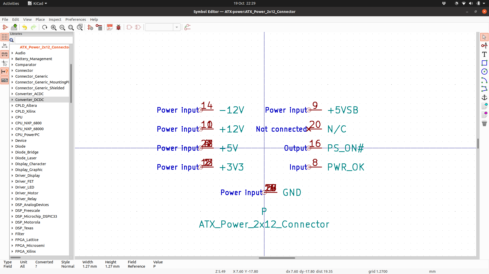

  1. All of the pins currently have their "connector" (where a wire will join the pin in the schematic) on the left, and their name on the right.  For the right-hand column of pins we should reverse that, and likewise update the `GND` pins to have the name at the top.

     Reopen the `Pin Table` dialog.  In the `Orientation` field, update the values for the `PWR_OK`, `+5VSB`, `PS_ON#` and `N/C` pins to `Left`, and all of the `GND` pins to `Up`.

     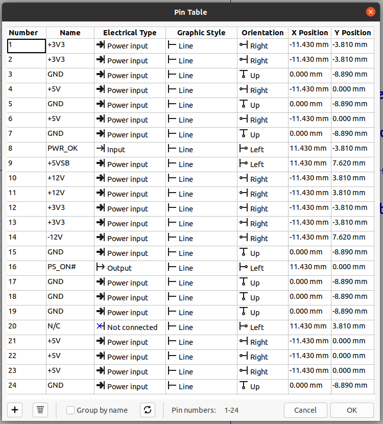

     Click `OK` to close the `Pin Table` dialog.  You might need to move some of the pins around to tidy up their positioning.

     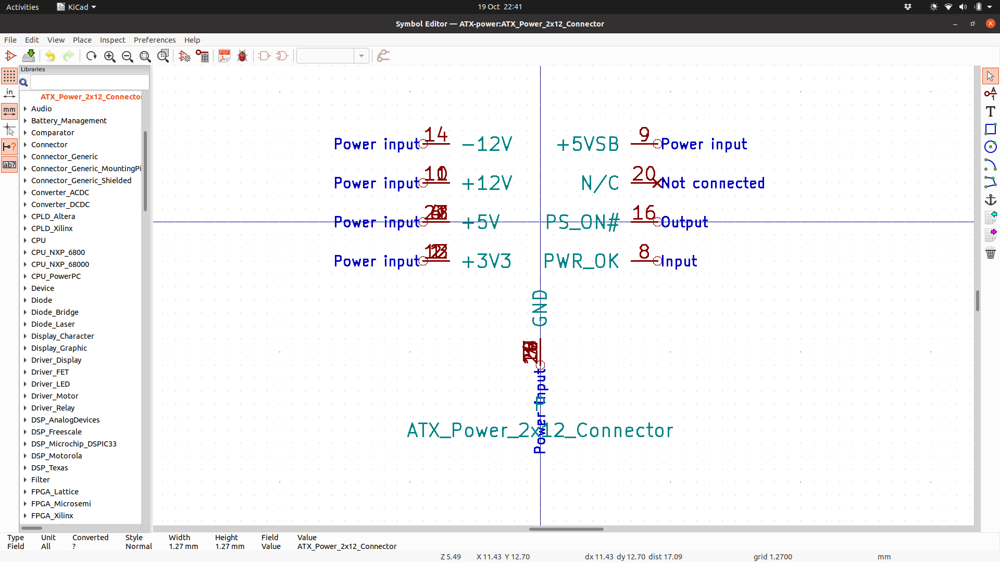

  1. Finally, choose the `Rectangle` tool from the right-hand toolbar, or choose `Place` -> `Rectangle` from the menu...

     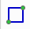

     And draw a rectangle around the pin names, along the ends of the pins themselves.  Obviously for more complex symbols you can use the cirle, arc, and polygon tools to draw it out.

     Once the rectangle is drawn, if you double-click on one of the sides, it will bring up the `Rectangle Drawing Properties` dialog.

     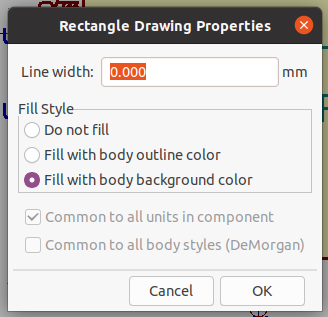

     Choose the "Fill with body background color" and the click `OK` to colour in the area of the component.

     For a last bit of fit-and-finish, because we have multiple pins in the same position on the ATX connector symbol, we should hide all but one of each group of pins.

     Hovering over a group of pins and type `e`.  That will pop up a menu showing a list of the relevant pins.  Choosing one will bring up the `Pin Properties` for that pin:

     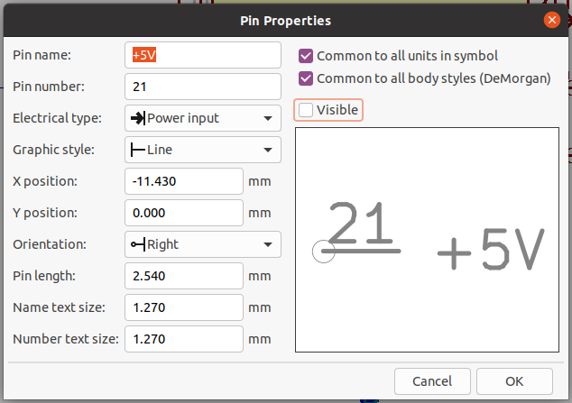

     If you uncheck the `Visible` checkbox then that pin will show up in the Symbol Editor as grey, and won't show at all in the schematic.  Repeat the process for each pin *except* the bottom one on the list, and repeat that process for each of the groups of pins.

     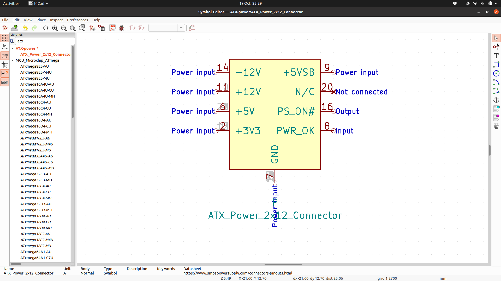

     With that done, our symbol is finished and ready to use in your schematic.  Choose `File` -> `Save` from the menu, and close the Symbol Editor.

## Footprints

