Although it's not an essential part of designing PCBs, the 3D capabilities of Kicad are becoming increasingly useful.

## Basic 3D View

When you're in Pcbnew laying out the board, you can easily get a 3D view of the board by selecting `View` -> `3D Viewer` from the menu, or hitting `Alt`+`3`.

That will open the 3D viewer.  The X, Y and Z buttons on the toolbar will let you rotate the model to view it from different angles:

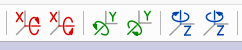

> If your board is rather flat and doesn't have any components on it, you probably don't have the Kicad 3D models installed.  On Linux check for the `kicad-packages3d` package.

Not every component will have a 3D model, particularly if it's a component that you've created.  See the [Adding 3D Models to Your Components](#adding-3d-models-to-your-components) section below to find out how to add new 3D models for individual components.

If you want to customize the view, the `Preferences` menu lets you choose things like the soldermask and silkscreen colours.  If you're planning on ordering from OSHPark and want to see it in their trademark purple, you can use [these OSHPark PCB colours](https://twitter.com/anool/status/1284167905186217984).

## Exporting a 3D Model

If you're also designing a case, or doing similar work, and want to know how the PCB fits into the physical design then it can be useful to have a 3D model of the board.

Creating that is surprisingly simple.

In the Pcbnew program, choose `File` -> `Export` -> `STEP...`.  Choose a filename, leave everything else at the defaults, and click the `Export` button.

That will generate a 3D model in the "step" format, which can then be loaded into most 3D CAD software, such as [FreeCAD](https://www.freecadweb.org/) and [Fusion360](https://www.autodesk.com/products/fusion-360/overview).

## Adding 3D Models to Your Components

Sometimes, such as when you've created the component yourself, there won't be a 3D model available for all of the components on your PCB.  In that case, you can create and add the relevant 3D models yourself.

### Getting the 3D Model

We're not going to cover creating a 3D model from scratch, that would be a whole course in itself.  However, you don't always need to create it.  There are a few options to try:

 * Check if the manufacturer of the component has created a 3D model
 * See if it's available from one of the component resellers&mdash;[Digikey](https://www.digikey.co.uk/) and [Mouser](https://www.mouser.co.uk) often have 3D models available alongside the datasheets for the component, so it's worth a look
 * Try a search on [GrabCAD](https://grabcad.com)
 * If none of the above work, then you'll have to design it yourself in your favourite CAD program.  If you don't have a favourite CAD program, [FreeCAD](https://www.freecadweb.org/) is a good option because that's what the official Kicad workbench works with.

### Associating the 3D Model With the Kicad Footprint

Once you've got a suitable model you need to tell Kicad how it relates to the footprint for the component in question.  This lets Kicad know how to orient the model to display it in the right place when generating the 3D view.

If you're happier in Fusion360 then check out this [guide to creating 3D models for Kicad in Fusion360](https://www.workshopshed.com/2019/04/creating-a-3d-model-for-kicad/) by Workshopshed.  Otherwise, read on...

To work through the steps we'll add the 3D model to the Molex ATX connector that we created in [the Making Footprints](../MakingFootprints) tutorial.  Helpfully there's a STEP file 3D model available [from Digikey page for that part](https://www.digikey.co.uk/products/en?keywords=Molex%2044206-0007), which is [included here for convenience](44206-0007_stp.zip).

 1. Install [FreeCAD](https://www.freecadweb.org/) if you don't already have it
 1. Then install [the KicadStepUp workbench for FreeCAD](https://wiki.freecadweb.org/KicadStepUp_Workbench#Installation)
 1. Run FreeCAD, and open the model that you found or created earlier.  You should have a vew like this:
    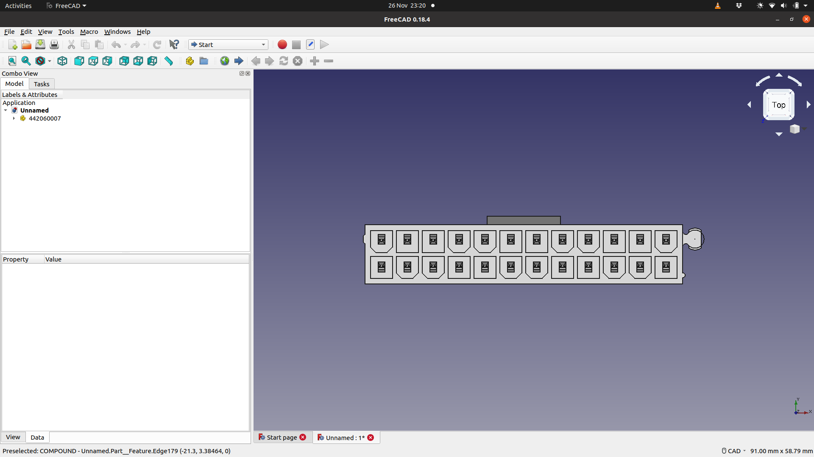
 1. Switch to the `KiCad StepUp Wb` workbench from the workbench chooser drop-down:
    
 1. Now load the Kicad footprint for your component by choosing `ksu PushPull` -> `ksu Load FootPrint`from the menu, and find the right `.kicad_mod` file for the component footprint.  That will draw the footprint in the model and add a new part in the Model browser on the left.  In this case that's `_Molex_44206_0007_socket__ATX_power___fp` and the footprint lines up quite well with the 3D model
    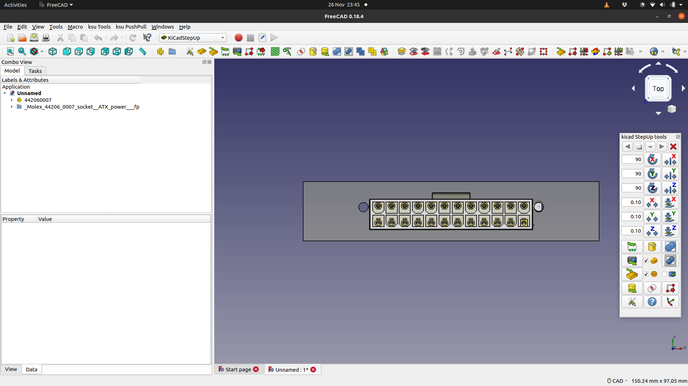
 1. Select the 3D model (not the footprint) in the Model browser on the left, and then use the X/Y/Z translate and rotate options in the `kicad StepUp tools` toolbar to move the model until it's in the right place on the footprint
    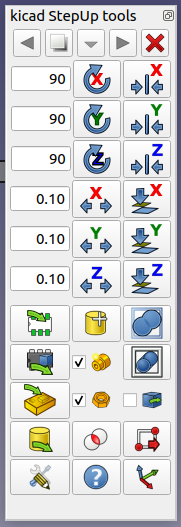
 1. Make sure you use the FreeCAD view gadget to look at the model from different angles to make sure you line things up in all axes
    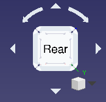
 1. When you've got it positioned correctly it will look something like this:
    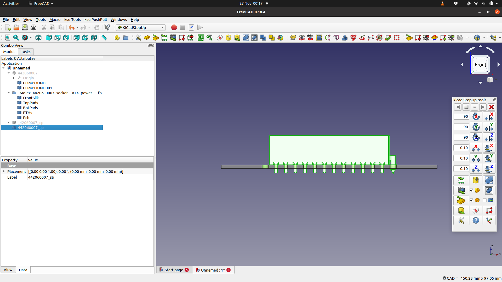
 1. Ensure the 3D model is (still) selected in the Model browser on the left, and then click the `export to kicad: STEP &amp; scaled VRML` button in the `kicad StepUp tools` toolbar:
    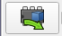
 1. Accept the default `Mesh Deviation` and `creaseAngle`
 1. Pick a suitable `Material Properties` value.  The Molex connectors are white, so we picked "white body" as the material
 1. You'll then see a dialog box like this one, showing where the 3D models have been saved:
    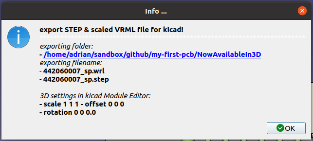
 1. Make a note of where the files were saved.  You should probably copy them to the same folder as your footprint file is stored in.
 1. Close FreeCAD and run Kicad.
 1. Run the `Footprint Editor` 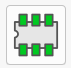
 1. Find the footprint in the browser on the left and double-click it to load it into the editor
 1. Choose `Edit` -> `Footprint Properties...` from the menu to open the Footprint Properties dialog.  Switch to the `3D Settings` tab:
    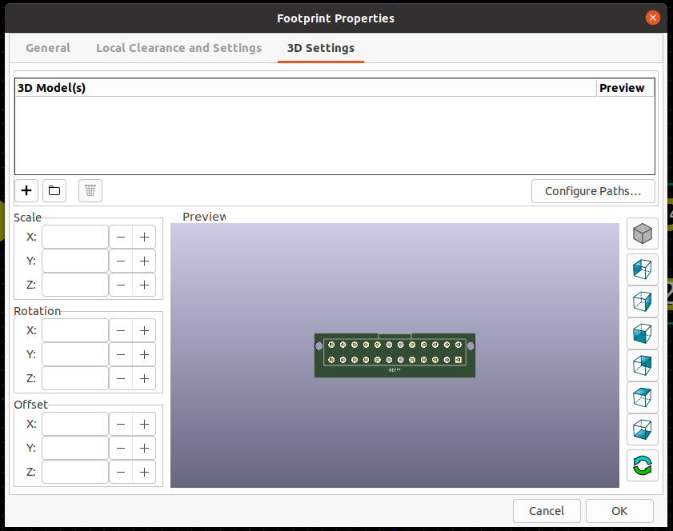
 1. Click the `Select 3D Model` icon 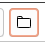 and find either the `.step` or the `.wrl` model file that you save a moment ago.
 1. You should then see the 3D model shown in the `Preview` window:
    
 1. If everything looks okay, click OK to close the `Footprint Properties` dialog
 1. Choose `File` -> `Save` from the menu to save the changes back to the footprint library.
 1. Close the `Footprint Editor` and your 3D model is now ready to use.
 1. If you've already used the footprint in one of your designs you'll need to update the footprint to load the 3D model:
    1. Open your existing design in `Pcbnew`
    1. Right-click on the footprint in question and choose `Update Footprint...`
    1. `Update selected footprint` should be selected.  That and the other default options will be fine.
       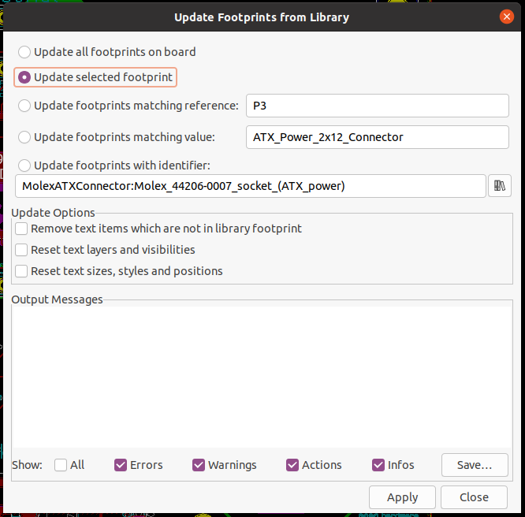
    1. Click `Apply` to update the footprint, and then `Close` to exit the dialog.
    1. Choose `View` -> `3D Viewer` in the menu to open the 3D viewer to double-check that the component now includes the 3D model!

