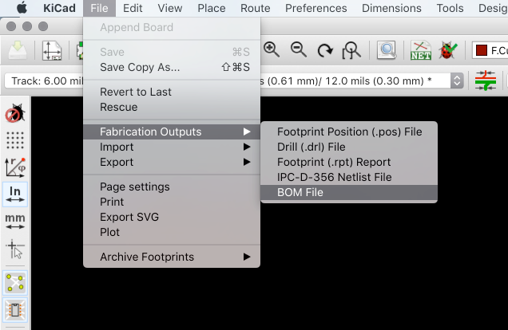

# Responsible electronics

At MCQN we want to advocate for good practices in making electronics responsibly. As beginners in making printed circuit boards, you are potentially the future of electronic making and manufacturing!

We've pulled together a few notes, resource and links here, but we hope to build on it in the future so [raise an issue if you think of a good link or project that relates](https://github.com/mcqn/my-first-pcb/issues).

### Documentation & Open Source

Documentation is all part of the responsibility of making electronics; not just safety and good practice  but our responsibility to the cost (economic, energy, environmental, social) of making electronics; documenting and sharing means people can re-use the work you've done. The less we have to re-invent and more we can re-use the things we need in the world the better.

If you are interested in open sourcing your project, it's worth noting that although very rewarding it's alot of hard work to present the source of your project and product in a way that's useful to other people. It can be quite a difficult process to really make open source hardware which we may touch on toward the end of the workshop.

Essentially it's about making clear documentation in conventions and formats that make sense. You can look around at some hardware projects and get the idea for how it's done. However just documenting your own work and all the useful parts of your Kicad workflow is a good place to start and is surprisingly useful.

Github and feature rich alternative  [Gitlab](https://gitlab.com/) is a good ubiquitous platform to do that. It may take you a while to get used to but it's well worth using. It's also a great resource for finding other components and projects to support or inspire your own.

Just starting an empty repository on git gets you into good habits, starting with a `README.md` file to explain the project, it's aims and contents, even to yourself, is really  helpful in focussing what you are doing and managing the project. Although github is meant for large teams of people to manage and maintain a project like people do at [DoESLiverpool](github.com/DoESLiverpool/somebody-should/issues/) just listing your own issues as a todo list is really useful when returning to an old project. Of course this can all safely live on your laptop before you publish online for anyone to see.

You can then share your design on other open source hardware platforms like [KitSpace](https://kitspace.org/) and [Hackaday](https://hackaday.com/) and [Hackster](https://www.hackster.io/)

### Useful Open Source Links

 * [Open Source Hardware Association ](https://www.oshwa.org/)
 * [Open Source Specialist Group](https://ossg.bcs.org/blog/category/hardware/oshug/)
 * [OSHPark](https://blog.oshpark.com)

 * [OpenKnowHow Standards](https://app.standardsrepo.com/MakerNetAlliance/OpenKnowHow/wiki)
 * [Gathering for Open Science Hardware](https://forum.openhardware.science/)

### Bill Of Materials

A [Bill of Materials](https://github.com/cheapjack/RF-Craft/blob/master/board/RF-Craft_BoM.csv) file is a comma or tab-seperated list of the components in your project to reference  Quantity, Value, Part, Footprint, Description, Vendor etc.

[One Click BOM](https://kitspace.org/1-click-bom/) is a plugin that uses your BOM `.tsv` file to automatically order the correct components for your project from popular component suppliers like Digikey and Mouser and helps you share information when open sourcing a project so others can make their own or build your design on demand.

If you ever get to the point of wanting to make and ship thousands of your amazing project, you may want someone like [European Circuits](https://european-circuits.co.uk/) to help assemble them.

The first thing they will ask for is your Bill of Materials. Getting into the practice of documenting this alongside all your schematic files and artwork could save you alot of time later. [Arduino create's web editor](https://create.arduino.cc/) now includes an asci README `.adoc` file which includes an example BOM entry

| ID | Part name      | Part number | Quantity
|--|--|--|--
| R1 | 10k Resistor   | 1234-abcd   | 10
| L1 | Red LED        | 2345-asdf   | 5

There's an example we generated from KiCad [here](https://github.com/mcqn/my-first-pcb/blob/master/ResponsibleElectronics/my-first-badge-life.csv) in `.csv` format but you can also use the [`.tsv`](https://github.com/mcqn/my-first-pcb/blob/master/ResponsibleElectronics/example.tsv) format or any comma/semi-colon/tab/space seperated list format or spreadsheet. To generate one from KiCad goto `Pcbnew` of your project and choose `File` -> `Fabrication Outputs` -> `BOM File` and save it in your output folder, which makes a semi-colon seperated list as a `.csv` file

### Mapping The Things

 * We produced a [map of local supply chains and trade counters](https://indie.mcqn.com/map) in the North West of the UK as part of some research on Indie (as in independent) Manufacturing.

 * [Sourcemaps](https://open.sourcemap.com/user/5e53f17738e818071948103d) is a really nice way of illustrating where all the parts of your product are made.
 * [Another Sourcemap](https://open.sourcemap.com/maps/607eea29fb367b6b1b91366e)

### Tracing the cost

We were inspired by  [@mrchrisadams](https://twitter.com/mrchrisadams) recent lecture on [Reducing Carbon In the Digital Realm](https://docs.google.com/presentation/d/1_uTPiW5aMCwFhZcpLDxjY-AQMgDmHIyUEZQQ-G6XXq8/edit#slide=id.g5d9e2f62d2_0_42) where he shared an energy toxicity matrix, a simple format for thinking and designing energy use in electronics and product development put together at [ThingsCon 2018](thingscon2018.productscience.net))

We've made our own [Materials Energy Toxicity Matrix](MET-Matrix.md) in markdown, which we like to think of as Bill of Materials but for the costs often treated as externalities

*"L’inizio dell’elaborazione critica è la coscienza di quello che è realmente, cioè un 'conosci te stesso' come prodotto del processo storico finora svoltosi che ha lasciato in te stesso un’infinità di tracce accolte senza beneficio d’inventario."*

*"The starting-point of critical elaboration is the consciousness of what one really is, and is 'knowing thyself' as a product of the historical process to date which has deposited in you an infinity of traces, without leaving an inventory."*

**Antonio Gramsci - Quaderni del carcere / The Prison Notebooks**

Technical practices and components have hugely dense networks of such traces, the work, care and history packed inside them. Who made and designed them, where and at what 'cost' were they made becomes relevant when we want to make ethically, with care and with love for the technology we use and depend on.

Things like Energy toxicity is vital in writing new histories and new traces into the stuff we make and maintain. Perhaps any previously thought of 'externality' needs to be considered in our technology's Bill Of Materials (BOM). So some kind of open source social justice audit, to inventorize these traces and costs for making, maintaining and using the technology we love is really important.

### Telling the story of your pcb/product?

All of this mapping and documenting are all part of the story of your project and product and where it sits in your community and the wider world of technological culture.

We've found and used a few tools out there to tell those stories.
 * [Ackers Bell supply chain map](https://open.sourcemap.com/maps/585e9cfa396e750727dae6bf)
 * [Materiom Library](https://materiom.org/visualise) Attempt by materiom to visualise material properties etc.
 * [1-click-BOM Documentationn](https://github.com/kitspace/1clickBOM)
 * [Standards Repo app](https://app.standardsrepo.com/MakerNetAlliance/OpenKnowHow/wiki)

### Further interesting/relevant links

 * [Follow The Things](http://www.followthethings.com/)
 * [Exposing the Invisible](https://kit.exposingtheinvisible.org/what/supply-chain.html) - Intro to investigating supply chains
 * [36C3 Talk at Chaos Communication Camp](https://media.ccc.de/v/36c3-10592-fairtronics) - Recorded talk about Fairtronics, a tool to help you investigate the fairness of your electronics supply chain
